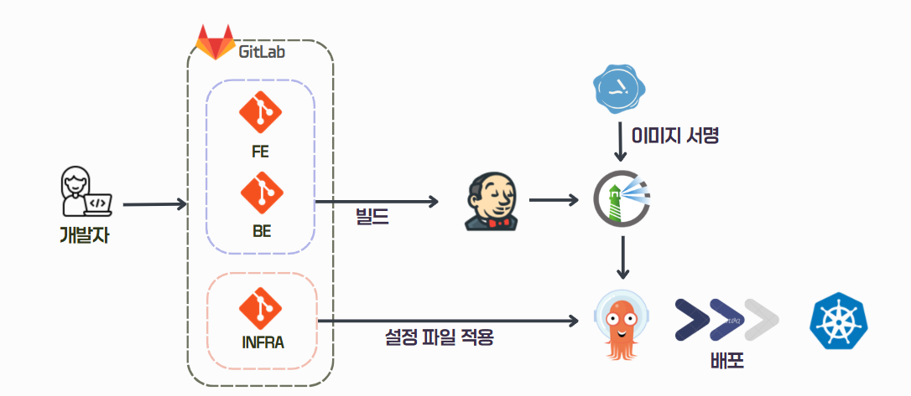
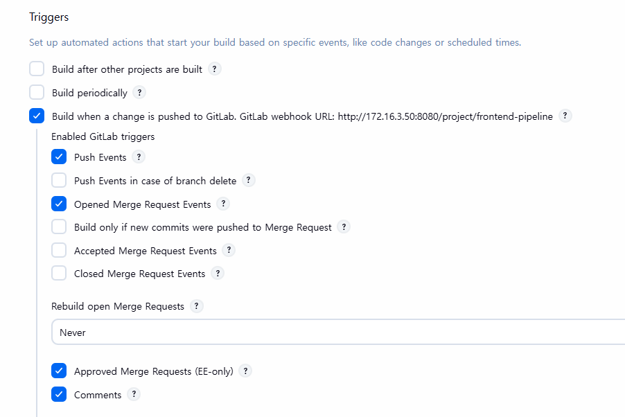
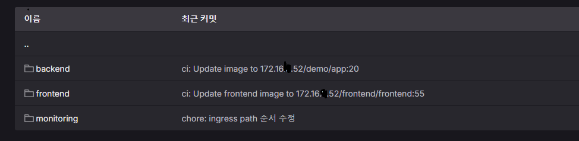
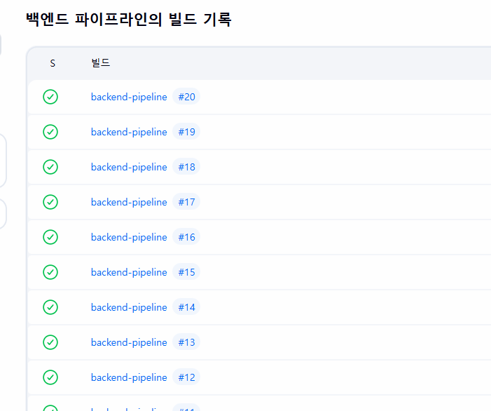

# CI/CD Pipeline

## 1. CI/CD 개요

 **내부 GitLab과 Jenkins를 연동하여 Backend 및 Frontend 애플리케이션의 CI/CD 파이프라인을 구성**하는 것을 목표로 한다.

개발자가 내부 GitLab의 개발 Repository에 코드를 Push하면, GitLab Webhook을 통해 Jenkins Pipeline이 자동으로 실행된다. Jenkins는 애플리케이션 소스 코드와 인프라 Repository를 함께 Clone한 뒤, 인프라 Repository에 정의된 Dockerfile을 사용하여 컨테이너 이미지를 빌드한다.

빌드된 이미지는 **Harbor Private Registry**에 저장되며, 이후 **Cosign을 사용하여 컨테이너 이미지 서명**을 수행한다. 마지막으로 Kubernetes Manifest의 이미지 태그를 최신 Jenkins Build Number로 변경하고, 변경된 내용을 다시 인프라 Repository에 Commit/Push한다.


---

## 2. CI/CD 구성 목적

본 Pipeline은 단순히 애플리케이션을 빌드하는 것에 그치지 않고, 실제 운영 환경에서 필요한 **이미지 저장소, 이미지 서명, 인프라 Repository 기반 Manifest 관리**까지 포함하는 것을 목표로 한다.

주요 목표는 다음과 같다.

* 내부 GitLab Repository 변경 사항을 Jenkins Webhook으로 감지
* Backend / Frontend 애플리케이션 자동 빌드
* 인프라 Repository에 정의된 Dockerfile을 사용하여 이미지 빌드
* Harbor Private Registry에 이미지 Push
* Cosign을 이용한 컨테이너 이미지 서명
* Kubernetes Manifest의 이미지 태그 자동 업데이트
* 인프라 Repository에 변경된 Manifest Commit & Push
* 향후 GitOps 또는 Kubernetes 배포 자동화와 연계 가능한 구조 구성

---

## 3. 전체 CI/CD 아키텍처




---

## 4. Repository 구성

본 CI/CD 구조는 애플리케이션 Repository와 인프라 Repository를 분리하여 사용한다.

```text
Application Repository
├── Backend Source Code
└── Frontend Source Code

Infra Repository
├── manifest/backend/Dockerfile
├── manifest/frontend/Dockerfile
├── Kubernetes YAML
└── Deployment Manifest
```

### Repository 분리 이유

* 애플리케이션 코드와 배포 인프라 구성을 분리하기 위함
* Dockerfile과 Kubernetes Manifest를 인프라 Repository에서 중앙 관리하기 위함
* 이미지 태그 변경 이력을 인프라 Repository에서 추적하기 위함
* 향후 ArgoCD 기반 GitOps 구조와 연계하기 위함

Jenkins Pipeline은 애플리케이션 Repository만 Clone하지 않고, 인프라 Repository도 함께 Clone한다.
이를 통해 애플리케이션 빌드 결과를 인프라 Repository의 Manifest에 반영할 수 있도록 구성하였다.

---

## 5. CI/CD Workflow

전체 Pipeline 흐름은 다음과 같다.

```text
1. Developer가 내부 GitLab의 dev 브랜치에 코드 Push
2. GitLab Webhook이 Jenkins Pipeline Trigger
3. Jenkins가 Application Repository Clone
4. Jenkins가 Infra Repository Clone
5. Backend 또는 Frontend 빌드 수행
6. Infra Repository의 Dockerfile로 Docker Image Build
7. Harbor Registry 로그인
8. Unsigned Image Push
9. Cosign으로 Image Signing
10. Infra Repository의 Kubernetes YAML Image Tag 변경
11. 변경된 Manifest Commit & Push
```

---

## 6. GitLab Webhook Trigger

Jenkins Job은 내부 GitLab Webhook과 연동되어 있다.




예시 Webhook URL:

```text
http://<JENKINS_IP>:8080/project/frontend-pipeline
```

활성화한 GitLab Trigger는 다음과 같다.

| Trigger                     | 설명                                            |
| --------------------------- | --------------------------------------------- |
| Push Events                 | 개발 Repository에 새로운 Commit이 Push되면 Pipeline 실행 |
| Opened Merge Request Events | Merge Request가 생성되면 Pipeline 실행               |
| Comments                    | 특정 Comment Regex와 일치하는 댓글이 작성되면 Pipeline 실행   |

Comment 기반 재실행 문구 예시:

```text
Jenkins please retry a build
```

이를 통해 개발자는 GitLab에서 코드를 Push하거나 MR을 생성했을 때 Jenkins Pipeline을 자동으로 실행할 수 있다.

---

## 7. Pipeline 종류

현재 구성된 Pipeline은 다음 두 가지이다.

| Pipeline          | 대상                  | Build Tool           | Image                                                |
| ----------------- | ------------------- | -------------------- | ---------------------------------------------------- |
| Backend Pipeline  | Spring Boot Backend | JDK 17, Gradle 9.2.0 | `<HARBOR_REGISTRY>/demo/app:<BUILD_NUMBER>`          |
| Frontend Pipeline | Next.js Frontend    | Node.js 20, npm      | `<HARBOR_REGISTRY>/frontend/frontend:<BUILD_NUMBER>` |

---

## 8. Backend Pipeline

Backend Pipeline은 Spring Boot 애플리케이션을 빌드하고, Docker 이미지로 패키징한 뒤 Harbor에 Push하고 Cosign으로 서명한다.

### 8.1 주요 환경 변수

```groovy
REGISTRY = "<HARBOR_REGISTRY>"
PROJECT  = "demo"
IMAGE    = "${REGISTRY}/${PROJECT}/app:${BUILD_NUMBER}"

GIT_REPO = "git@<GITLAB_IP>:cve-labhub/cve-labhub-backend.git"
GIT_BRANCH = "dev"

INFRA_REPO = "git@<GITLAB_IP>:cve-labhub/cve-labhub-infra.git"
INFRA_BRANCH = "main"
```

### 8.2 Pipeline Stages

| Stage                          | 설명                                                  |
| ------------------------------ | --------------------------------------------------- |
| Clone Repositories             | Backend Repository와 Infra Repository Clone          |
| Build Artifact                 | Gradle을 사용해 Spring Boot 애플리케이션 빌드                   |
| Docker Build                   | Infra Repository의 Backend Dockerfile로 이미지 빌드        |
| Docker Login to Harbor         | Jenkins Credential을 사용해 Harbor 로그인                  |
| Push Unsigned Image            | Harbor에 이미지 Push                                    |
| Sign Image with Cosign         | Cosign Private Key로 이미지 서명                          |
| Cleanup                        | Jenkins Agent 로컬 이미지 삭제                             |
| Update YAML Image Tag and Push | Infra Repository의 Backend Manifest 이미지 태그 갱신 후 Push |

### 8.3 Backend Build

```bash
gradle clean build -x test --info
```

현재 Pipeline에서는 빌드 시간을 줄이기 위해 테스트 단계를 제외하고 빌드를 수행한다.

```bash
-x test
```

다만 운영 수준의 CI/CD에서는 Unit Test 또는 Integration Test를 별도 Stage로 분리하는 것이 더 적절하다.

### 8.4 Backend Docker Build

```bash
docker build -t ${IMAGE} -f infra/manifest/backend/Dockerfile backend
```

Backend Dockerfile은 애플리케이션 Repository가 아니라 Infra Repository에서 관리한다.

```text
infra/manifest/backend/Dockerfile
```

이를 통해 애플리케이션 코드와 배포 인프라 구성을 분리하였다.

---

## 9. Frontend Pipeline

Frontend Pipeline은 Next.js 애플리케이션을 빌드하고, Docker 이미지로 패키징한 뒤 Harbor에 Push하고 Cosign으로 서명한다.

### 9.1 주요 환경 변수

```groovy
REGISTRY = "<HARBOR_REGISTRY>"
PROJECT  = "frontend"
IMAGE    = "${REGISTRY}/${PROJECT}/frontend:${BUILD_NUMBER}"

GIT_REPO = "git@<GITLAB_IP>:cve-labhub/cve-labhub-frontend.git"
GIT_BRANCH = "dev"

INFRA_REPO = "git@<GITLAB_IP>:cve-labhub/cve-labhub-infra.git"
INFRA_BRANCH = "main"
```

Frontend Build 시에는 API Endpoint 관련 Build Argument를 함께 전달한다.

```groovy
NEXT_PUBLIC_API_BASE = "https://<DOMAIN>"
NEXT_PUBLIC_LAMBDA_ANALYSIS_URL = "<LAMBDA_FUNCTION_URL>"
LAMBDA_ANALYSIS_URL = "<LAMBDA_FUNCTION_URL>"
```

공개 Repository에 README를 작성할 때는 실제 Endpoint 값을 직접 노출하지 않고 Placeholder로 관리하는 것이 좋다.

### 9.2 Pipeline Stages

| Stage                          | 설명                                                   |
| ------------------------------ | ---------------------------------------------------- |
| Clone Repositories             | Frontend Repository와 Infra Repository Clone          |
| Install Dependencies           | npm ci를 사용해 의존성 설치                                   |
| Build Frontend                 | Next.js Production Build 수행                          |
| Docker Build                   | Infra Repository의 Frontend Dockerfile로 이미지 빌드        |
| Docker Login to Harbor         | Jenkins Credential을 사용해 Harbor 로그인                   |
| Push Unsigned Image            | Harbor에 이미지 Push                                     |
| Sign Image with Cosign         | Cosign Private Key로 이미지 서명                           |
| Cleanup                        | Jenkins Agent 로컬 이미지 삭제                              |
| Update YAML Image Tag and Push | Infra Repository의 Frontend Manifest 이미지 태그 갱신 후 Push |

### 9.3 Frontend Build

```bash
npm ci
npm run build
```

`npm ci`는 `package-lock.json` 기준으로 의존성을 설치하므로, CI 환경에서 재현 가능한 빌드를 수행하는 데 적합하다.

### 9.4 Frontend Docker Build

```bash
docker build --no-cache \
  --build-arg NEXT_PUBLIC_API_BASE=${NEXT_PUBLIC_API_BASE} \
  --build-arg NEXT_PUBLIC_LAMBDA_ANALYSIS_URL=${NEXT_PUBLIC_LAMBDA_ANALYSIS_URL} \
  --build-arg LAMBDA_ANALYSIS_URL=${LAMBDA_ANALYSIS_URL} \
  -t ${IMAGE} \
  -f infra/manifest/frontend/Dockerfile frontend
```

Frontend는 Next.js 환경 변수 주입이 필요하므로 Docker Build 단계에서 `--build-arg`를 사용하였다.

---

## 10. Harbor Registry

Pipeline은 Harbor Private Registry를 이미지 저장소로 사용한다.

<!-- 여기에 Harbor Project / Image Repository 화면 넣기 -->

이미지 Naming Rule은 다음과 같다.

### Backend Image

```text
<HARBOR_REGISTRY>/demo/app:<BUILD_NUMBER>
```

예시:

```text
172.16.X.52/demo/app:25
```

### Frontend Image

```text
<HARBOR_REGISTRY>/frontend/frontend:<BUILD_NUMBER>
```

예시:

```text
172.16.X.52/frontend/frontend:25
```

Jenkins Build Number를 이미지 태그로 사용하여 빌드 결과물과 Jenkins 실행 이력을 추적할 수 있도록 구성하였다.

---

## 11. Cosign Image Signing

이미지를 Harbor에 Push한 후 Cosign을 사용해 이미지 서명을 수행한다.


```bash
cosign sign --yes --key "$COSIGN_KEY" ${IMAGE}
```

Jenkins에서는 다음 Credential을 사용한다.

| Credential ID | Type        | 설명                  |
| ------------- | ----------- | ------------------- |
| `cosign-key`  | Secret File | Cosign Private Key  |
| `cosign-pass` | Secret Text | Cosign Key Password |

Pipeline에서는 Jenkins Credential을 통해 서명 키와 비밀번호를 주입한다.

```groovy
withCredentials([
    file(credentialsId: 'cosign-key', variable: 'COSIGN_KEY'),
    string(credentialsId: 'cosign-pass', variable: 'COSIGN_PASS')
]) {
    sh '''
        export COSIGN_PASSWORD="$COSIGN_PASS"
        cosign sign --yes --key "$COSIGN_KEY" ${IMAGE}
    '''
}
```

Cosign 서명은 Docker 이미지 자체를 수정하는 방식이 아니라, 이미지 Digest에 대한 Signature Artifact를 Registry에 추가로 저장하는 방식이다.
이를 통해 Harbor에 Push된 이미지가 CI/CD Pipeline을 통해 생성된 신뢰 가능한 이미지인지 검증할 수 있는 기반을 마련하였다.

---

## 12. Infra Repository Manifest Update

이미지 Push 및 서명 이후, Pipeline은 Infra Repository의 Kubernetes Manifest에 정의된 이미지 태그를 최신 Build Number로 변경한다.




### Backend Manifest Update

```bash
IMAGE_PATH="${REGISTRY}/${PROJECT}/app"
NEW_TAG="${BUILD_NUMBER}"

grep -rl "${IMAGE_PATH}:" . | while read -r file; do
    sed -i "s|${IMAGE_PATH}:.*|${IMAGE_PATH}:${NEW_TAG}|g" "$file"
done

git add .
git commit -m "ci: Update image to ${IMAGE_PATH}:${NEW_TAG}" || echo "No changes to commit"
git push origin ${INFRA_BRANCH}
```

### Frontend Manifest Update

```bash
IMAGE_PATH="${REGISTRY}/${PROJECT}/frontend"
NEW_TAG="${BUILD_NUMBER}"

git fetch origin
git reset --hard origin/main

grep -rl "${IMAGE_PATH}:" manifest/frontend | while read -r file; do
    sed -i "s|${IMAGE_PATH}:.*|${IMAGE_PATH}:${NEW_TAG}|g" "$file"
done

git add manifest/frontend
git commit -m "ci: Update frontend image to ${IMAGE_PATH}:${NEW_TAG}" || echo "No changes to commit"
git pull --rebase origin main || true
git push origin ${INFRA_BRANCH}
```

이 과정을 통해 애플리케이션 이미지 빌드 결과가 인프라 Repository의 배포 Manifest에 반영된다.

---

## 13. Jenkins Credentials

Pipeline 실행을 위해 Jenkins에는 다음 Credentials가 필요하다.

| Credential ID       | Type                | 사용 목적                             |
| ------------------- | ------------------- | --------------------------------- |
| `git`               | SSH Private Key     | 내부 GitLab Repository Clone 및 Push |
| `harbor-credential` | Username / Password | Harbor Registry Login             |
| `cosign-key`        | Secret File         | Cosign Image Signing Key          |
| `cosign-pass`       | Secret Text         | Cosign Key Password               |

Credential 값은 Jenkins 내부에서만 관리하고, Git Repository에는 절대 포함하지 않는다.

---

## 14. Jenkins Tool Configuration

Jenkins Global Tool Configuration에 다음 도구가 설정되어 있어야 한다.

### Backend Pipeline

| Tool   | Jenkins Tool Name |
| ------ | ----------------- |
| JDK    | `jdk-17`          |
| Gradle | `gradle-9.2.0`    |

### Frontend Pipeline

| Tool    | Jenkins Tool Name |
| ------- | ----------------- |
| Node.js | `node-20`         |

Jenkinsfile의 `tools` 블록에서 위 이름을 참조하므로, Jenkins에 등록된 Tool Name과 Jenkinsfile의 이름이 일치해야 한다.

---

## 15. Jenkins Agent 실행 환경

Jenkins Agent에는 다음 도구가 설치되어 있어야 한다.

```text
- git
- docker
- cosign
- ssh-agent
- Jenkins GitLab Plugin
- Jenkins NodeJS Plugin
- Jenkins Gradle Plugin
```

Docker Build 및 Push를 수행하기 위해 Jenkins Agent는 Docker Daemon에 접근할 수 있어야 한다.

확인 명령어:

```bash
docker version
docker info
cosign version
git --version
```

---

## 16. 검증 방법

Pipeline 실행 후 다음 항목을 확인한다.

### 16.1 Jenkins Build Result

Jenkins Job 화면에서 Pipeline이 Success 상태인지 확인한다.



```text
Status: Success
```

### 16.2 Harbor Image 확인

Harbor Project에서 이미지가 Push되었는지 확인한다.


Backend:

```text
demo/app:<BUILD_NUMBER>
```

Frontend:

```text
frontend/frontend:<BUILD_NUMBER>
```

### 16.3 Cosign Signature 확인

Cosign으로 이미지 서명을 검증한다.

```bash
cosign verify --key cosign.pub <HARBOR_REGISTRY>/demo/app:<BUILD_NUMBER>
```

Frontend 이미지 검증:

```bash
cosign verify --key cosign.pub <HARBOR_REGISTRY>/frontend/frontend:<BUILD_NUMBER>
```

### 16.4 Infra Repository Manifest 확인

Infra Repository에서 Kubernetes YAML의 이미지 태그가 최신 Build Number로 변경되었는지 확인한다.

```bash
grep -R "<HARBOR_REGISTRY>/demo/app:" manifest/backend
grep -R "<HARBOR_REGISTRY>/frontend/frontend:" manifest/frontend
```

---

## 17. Troubleshooting

CI/CD Pipeline 구성 과정에서 발생할 수 있는 주요 문제와 해결 방법을 정리하였다.

---

### 17.1 GitLab Webhook은 성공했지만 Jenkins Pipeline이 실행되지 않는 문제

#### 문제 상황

GitLab에서 Webhook Test는 성공했지만 Jenkins Job이 자동 실행되지 않았다.

#### 원인

Jenkins Job의 GitLab Trigger 설정 또는 Webhook URL이 올바르지 않을 수 있다.
또한 GitLab Plugin에서 지정한 Project Name과 Webhook URL의 Job 이름이 맞지 않으면 Trigger가 동작하지 않을 수 있다.

#### 확인 방법

Jenkins Job의 Trigger 설정을 확인한다.

```text
Build when a change is pushed to GitLab
```

Webhook URL 예시:

```text
http://<JENKINS_IP>:8080/project/<PIPELINE_NAME>
```

GitLab Repository의 Webhook URL과 Jenkins Job의 Pipeline 이름이 일치하는지 확인한다.

#### 해결 방법

* Jenkins Job에서 GitLab Trigger 활성화
* GitLab Webhook URL 재확인
* Push Events 활성화
* 필요 시 Secret Token 설정 확인
* Jenkins System Log에서 GitLab Webhook 요청 수신 여부 확인

---

### 17.2 Jenkins가 내부 GitLab Repository를 Clone하지 못하는 문제

#### 문제 상황

Pipeline의 `Clone Repositories` 단계에서 Git Clone이 실패하였다.

#### 원인

Jenkins Credential에 등록된 SSH Key가 GitLab Repository 접근 권한을 갖고 있지 않거나, Jenkins Agent에서 GitLab 서버로 SSH 접속이 불가능한 경우 발생한다.

#### 확인 방법

Jenkins Agent에서 GitLab SSH 접근을 확인한다.

```bash
ssh -T git@<GITLAB_IP>
```

Git Remote URL 형식도 확인한다.

```text
git@<GITLAB_IP>:cve-labhub/cve-labhub-backend.git
```

#### 해결 방법

* Jenkins Credential ID `git`에 올바른 SSH Private Key 등록
* GitLab Deploy Key 또는 사용자 SSH Key 등록
* Jenkins Agent의 `known_hosts` 등록
* 방화벽 또는 네트워크 접근 정책 확인

---

### 17.3 Docker Build 단계에서 Dockerfile을 찾지 못하는 문제

#### 문제 상황

Docker Build 단계에서 다음과 같은 오류가 발생할 수 있다.

```text
unable to prepare context
Dockerfile not found
```

#### 원인

Pipeline은 애플리케이션 Repository가 아니라 Infra Repository 안의 Dockerfile을 참조한다.

Backend:

```text
infra/manifest/backend/Dockerfile
```

Frontend:

```text
infra/manifest/frontend/Dockerfile
```

따라서 Infra Repository Clone이 실패했거나, Dockerfile 경로가 변경되면 Docker Build가 실패한다.

#### 해결 방법

Infra Repository 구조를 확인한다.

```bash
ls -l infra/manifest/backend/Dockerfile
ls -l infra/manifest/frontend/Dockerfile
```

Docker Build 명령어의 `-f` 경로를 실제 Dockerfile 위치와 일치시킨다.

---

### 17.4 Harbor Login 실패

#### 문제 상황

`docker login` 단계에서 인증 실패가 발생하였다.

#### 원인

Jenkins Credential에 등록된 Harbor 계정 정보가 잘못되었거나, Harbor Project에 Push 권한이 없을 수 있다.

#### 확인 방법

Jenkins Agent에서 직접 로그인 테스트를 수행한다.

```bash
docker login <HARBOR_REGISTRY>
```

#### 해결 방법

* Jenkins Credential ID `harbor-credential` 확인
* Harbor 사용자 계정의 Project Push 권한 확인
* Harbor Registry 주소 확인
* 사설 인증서 사용 시 Docker Daemon의 insecure registry 또는 CA 인증서 설정 확인

---

### 17.5 Cosign 서명 실패

#### 문제 상황

이미지 Push 후 Cosign 서명 단계에서 실패한다.

#### 원인

Cosign Key 파일 또는 Password Credential이 잘못되었거나, Harbor Registry에 서명 Artifact를 Push할 권한이 없을 수 있다.

#### 확인 방법

```bash
cosign version
cosign sign --key cosign.key <IMAGE>
```

#### 해결 방법

* Jenkins Credential ID `cosign-key` 확인
* Jenkins Credential ID `cosign-pass` 확인
* `COSIGN_PASSWORD` 환경 변수 설정 확인
* Harbor Registry에 Cosign Signature Push 권한 확인

---

### 17.6 Infra Repository Push 실패

#### 문제 상황

Manifest 이미지 태그는 변경되었지만 Infra Repository에 Push가 실패하였다.

#### 원인

Pipeline 실행 중 다른 Pipeline 또는 사용자가 Infra Repository의 `main` 브랜치에 먼저 Push한 경우 충돌이 발생할 수 있다.

#### 해결 방법

Frontend Pipeline에서는 다음과 같이 원격 main을 기준으로 reset 후 변경하고, push 전에 rebase를 수행한다.

```bash
git fetch origin
git reset --hard origin/main
git pull --rebase origin main || true
git push origin main
```

Backend Pipeline에서도 동일하게 `git fetch`, `git reset --hard origin/main`, `git pull --rebase` 흐름을 적용하면 충돌 가능성을 줄일 수 있다.

---


