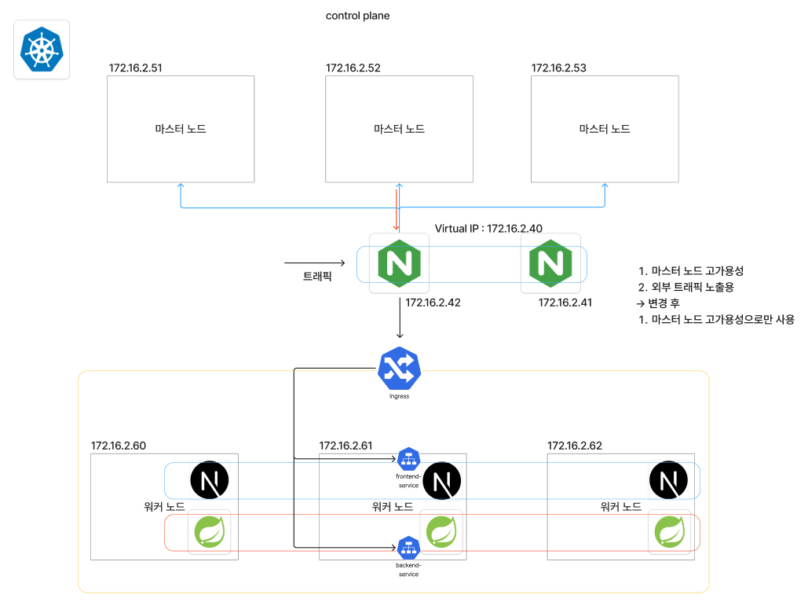
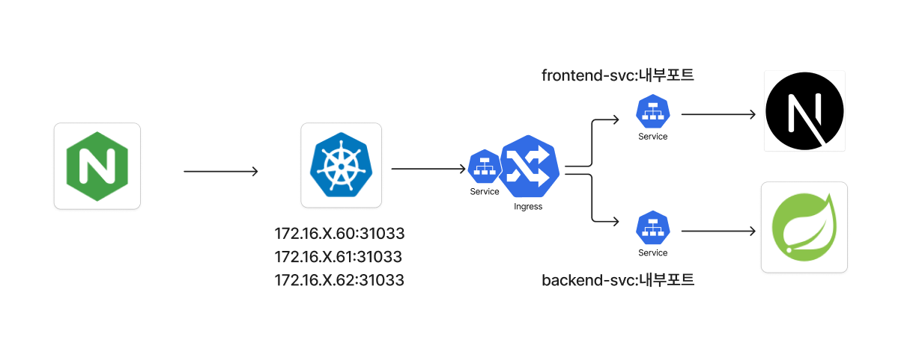

# Kubernetes Deployment Manifests

## 1. 프로젝트 개요

본 프로젝트는 **CVE LabHub 서비스의 Backend, Frontend, Monitoring 리소스를 Kubernetes 환경에 배포하기 위한 Manifest를 관리**하는 것을 목표로 한다.

Backend는 Spring Boot 기반 애플리케이션으로 구성되어 있으며, CVE 실습 플랫폼의 API 서버 역할을 수행한다. Frontend는 Next.js 기반 웹 애플리케이션으로 구성되어 있으며, 사용자가 CVE 실습 플랫폼에 접근하는 UI 역할을 담당한다.

Monitoring 영역은 Prometheus 기반 메트릭 수집과 Alert Rule 구성을 담당한다. Backend 애플리케이션의 Actuator Prometheus Endpoint를 ServiceMonitor로 수집하고, PrometheusRule을 통해 CPU 사용률 기반 알람을 구성한다.

본 Manifest 구성은 Jenkins CI/CD Pipeline에서 Harbor에 Push한 Backend / Frontend 이미지를 Kubernetes에 배포하기 위한 인프라 Repository의 일부로 사용된다.

---

## 2. Kubernetes 구성 목적

본 Kubernetes Manifest의 목적은 단순한 애플리케이션 실행이 아니라, **서비스 배포, 외부 접근, 환경 변수 관리, Secret 관리, 모니터링 연동**까지 포함한 배포 구조를 구성하는 것이다.

주요 목표는 다음과 같다.

* Spring Boot Backend 애플리케이션 배포
* Next.js Frontend 애플리케이션 배포
* Harbor Private Registry 이미지 Pull
* ConfigMap 기반 환경 변수 관리
* Secret 기반 민감 정보 관리
* NodePort Service를 통한 서비스 노출
* Ingress를 통한 Frontend / Backend 라우팅
* Backend Actuator Prometheus Endpoint 수집
* Prometheus ServiceMonitor 구성
* PrometheusRule 기반 CPU 사용률 알람 구성
* 향후 GitOps 또는 CI/CD Pipeline과 연동 가능한 Manifest 구조 구성

---

## 3. 전체 아키텍처



---

## 4. 디렉터리 구조

본 Manifest는 Backend, Frontend, Monitoring 영역으로 분리하여 관리한다.

```text
kubernetes/
├── backend/
│   ├── cvelabhub_config.yaml
│   ├── cvelabhub_secret.yaml
│   ├── cvelabhub_deployment.yaml
│   ├── cvelabhub_service.yaml
│   ├── backend_prometheus_servicemonitor.yaml
│   └── Dockerfile
│
├── frontend/
│   ├── cvelabhub_config.yaml
│   ├── cvelabhub_deployment.yaml
│   ├── cvelabhub_service.yaml
│   ├── cvelabhub_ingress.yaml
│   └── Dockerfile
│
├── monitoring/
│   ├── custom-values.yaml
│   └── high-cpu-rule.yaml
│
├── security/ 
│ └── cvelabhub_networkpolicy.yaml
│
└── README.md
```

---

## 5. Backend 구성

Backend는 Spring Boot 기반 애플리케이션이며, Kubernetes에서는 다음 리소스로 구성된다.

| Resource       | 파일                                               | 설명                                      |
| -------------- | ------------------------------------------------ | --------------------------------------- |
| ConfigMap      | `backend/cvelabhub_config.yaml`                  | Backend 환경 변수 관리                        |
| Secret         | `backend/cvelabhub_secret.yaml`                  | DB, Keycloak, AWS, Guacamole 등 민감 정보 관리 |
| Deployment     | `backend/cvelabhub_deployment.yaml`              | Spring Boot Pod 배포                      |
| Service        | `backend/cvelabhub_service.yaml`                 | Backend HTTP / Monitoring Port 노출       |
| ServiceMonitor | `backend/backend_prometheus_servicemonitor.yaml` | Prometheus Scrape 대상 등록                 |
| Dockerfile     | `backend/Dockerfile`                             | Spring Boot 애플리케이션 이미지 빌드               |

---

## 6. Backend Deployment

Backend Deployment는 `cvelabhub-back`이라는 이름으로 `default` namespace에 배포된다.

```yaml
apiVersion: apps/v1
kind: Deployment
metadata:
  name: cvelabhub-back
  namespace: default
  labels:
    app: cvelabhub-back
spec:
  replicas: 1
```

Pod Label은 다음과 같다.

```yaml
labels:
  app: cvelabhub-back
```

이 Label은 Backend Service와 ServiceMonitor의 Selector에서 사용된다.

### Backend Container

Backend 컨테이너는 Harbor Private Registry의 이미지를 사용한다.

```yaml
containers:
  - name: cvelabhub-app
    image: <HARBOR_REGISTRY>/demo/app:<BUILD_NUMBER>
    imagePullPolicy: IfNotPresent
```

예시:

```text
172.16.X.52/demo/app:20
```

Jenkins Pipeline에서 Backend 이미지를 빌드하고 Harbor에 Push한 뒤, 해당 이미지 태그가 이 Deployment Manifest에 반영된다.

---

## 7. Backend Port 구성

Backend Pod는 두 개의 포트를 사용한다.

| Port   | 용도                                        |
| ------ | ----------------------------------------- |
| `8082` | Spring Boot API 서버                        |
| `9090` | Actuator / Prometheus Monitoring Endpoint |

Deployment 설정:

```yaml
ports:
  - containerPort: 8082
  - containerPort: 9090
```

Backend Service는 두 포트를 각각 노출한다.

```yaml
ports:
  - name: http
    port: 8082
    targetPort: 8082
    nodePort: 30081

  - name: monitoring
    port: 9090
    targetPort: 9090
```

Prometheus ServiceMonitor는 Service의 `monitoring` port를 참조하여 `/actuator/prometheus` 경로를 Scrape한다.

---

## 8. Backend ConfigMap

Backend ConfigMap은 애플리케이션 실행에 필요한 환경 변수를 관리한다.

```yaml
apiVersion: v1
kind: ConfigMap
metadata:
  name: cvelabhub-config
  namespace: default
data:
  SERVER_PORT: "8082"
  DB_HOST: "<DB_HOST>:3306"
  DB_NAME: "cveuser"
  DB_USER: "root"
```

주요 환경 변수는 다음과 같다.

| Category         | Environment                                                                    |
| ---------------- | ------------------------------------------------------------------------------ |
| Server           | `SERVER_PORT`                                                                  |
| Database         | `DB_HOST`, `DB_NAME`, `DB_USER`                                                |
| Keycloak         | `KEYCLOAK_ISSUER`, `KEYCLOAK_CLIENT_ID`, `KEYCLOAK_BASE_URL`, `KEYCLOAK_REALM` |
| Mail             | `MAIL_HOST`, `MAIL_PORT`, `MAIL_USERNAME`, `MAIL_PROTOCOL`                     |
| AWS S3           | `AWS_S3_REGION`, `AWS_S3_BUCKET_NAME`                                          |
| CORS             | `CORS_ALLOWED_ORIGINS`, `CORS_ALLOWED_METHODS`, `CORS_ALLOWED_HEADERS`         |
| Guacamole        | `GUACAMOLE_SERVER_BASE_URL`, `GUACAMOLE_DB_URL`                                |
| Terraform Runner | `TERRAFORM_SERVER_URL`                                                         |
| MCP Server       | `MCP_SERVER_BASE_URL`                                                          |
| CloudWatch       | `AWS_CLOUDWATCH_DEFAULT_REGION`, `AWS_CLOUDWATCH_LOG_GROUP`                    |

ConfigMap은 민감하지 않은 설정값만 포함하는 것이 원칙이다.

---

## 9. Backend Secret

Backend Secret은 DB Password, Keycloak Client Secret, AWS Access Key, Guacamole Password, SSH Private Key 등 민감 정보를 관리한다.

```yaml
apiVersion: v1
kind: Secret
metadata:
  name: cvelabhub-secret
  namespace: default
type: Opaque
stringData:
  DB_PASS: "<DB_PASSWORD>"
  KEYCLOAK_CLIENT_SECRET: "<KEYCLOAK_CLIENT_SECRET>"
```

Deployment에서는 `envFrom`을 통해 ConfigMap과 Secret을 함께 주입한다.

```yaml
envFrom:
  - configMapRef:
      name: cvelabhub-config
  - secretRef:
      name: cvelabhub-secret
```

### Secret 관리 주의사항

`Secret`은 Kubernetes에서 Base64로 인코딩되어 저장될 뿐, 기본적으로 강한 암호화 저장소가 아니다.
따라서 GitHub 공개 Repository에는 실제 Secret 값을 절대 Commit하지 않는다.

권장 방식:

* 실제 Secret YAML은 Git에 포함하지 않음
* `cvelabhub_secret.example.yaml`만 관리
* 운영 Secret은 `kubectl create secret`, SealedSecret, External Secrets Operator, Vault 등을 사용
* AWS Access Key, SSH Private Key, DB Password는 노출 시 즉시 폐기 및 재발급

---

## 10. Backend Service

Backend Service는 `cvelabhub-app-svc`라는 이름으로 생성된다.

```yaml
apiVersion: v1
kind: Service
metadata:
  name: cvelabhub-app-svc
  namespace: default
  labels:
    app: cvelabhub-back
spec:
  type: NodePort
  selector:
    app: cvelabhub-back
```

Service Port 구성:

| Name         |   Port | TargetPort | NodePort | 용도                |
| ------------ | -----: | ---------: | -------: | ----------------- |
| `http`       | `8082` |     `8082` |  `30081` | Backend API       |
| `monitoring` | `9090` |     `9090` |        - | Prometheus Scrape |

`monitoring` port의 이름은 ServiceMonitor에서 참조하므로 반드시 일치해야 한다.

```yaml
endpoints:
  - port: monitoring
```

---

## 11. Backend Dockerfile

Backend Dockerfile은 Spring Boot Build 결과물인 JAR 파일을 컨테이너 이미지로 패키징한다.

```dockerfile
FROM amazoncorretto:17-alpine

COPY ./build/libs/CveLabhubBack-0.0.1-SNAPSHOT.jar app.jar

EXPOSE 8082
ENTRYPOINT ["java", "-jar", "app.jar"]
```

### Backend Image Build 흐름

```text
Gradle Build
→ build/libs/*.jar 생성
→ Dockerfile로 이미지 빌드
→ Harbor Push
→ Kubernetes Deployment에서 해당 이미지 사용
```

---

## 12. Frontend 구성

Frontend는 Next.js 기반 애플리케이션이며, Kubernetes에서는 다음 리소스로 구성된다.

| Resource   | 파일                                   | 설명                          |
| ---------- | ------------------------------------ | --------------------------- |
| ConfigMap  | `frontend/cvelabhub_config.yaml`     | Frontend 환경 변수 관리           |
| Deployment | `frontend/cvelabhub_deployment.yaml` | Next.js Pod 배포              |
| Service    | `frontend/cvelabhub_service.yaml`    | Frontend Service 노출         |
| Ingress    | `frontend/cvelabhub_ingress.yaml`    | Frontend / Backend HTTP 라우팅 |
| Dockerfile | `frontend/Dockerfile`                | Next.js 애플리케이션 이미지 빌드       |

---

## 13. Frontend Deployment

Frontend Deployment는 `cvelabhub-frontend`라는 이름으로 `default` namespace에 배포된다.

```yaml
apiVersion: apps/v1
kind: Deployment
metadata:
  name: cvelabhub-frontend
  namespace: default
spec:
  replicas: 1
```

Pod Label:

```yaml
labels:
  app: cvelabhub-frontend
```

Frontend 컨테이너 이미지는 Harbor Private Registry에서 Pull한다.

```yaml
containers:
  - name: cvelabhub-frontend
    image: <HARBOR_REGISTRY>/frontend/frontend:<BUILD_NUMBER>
    imagePullPolicy: IfNotPresent
```

예시:

```text
172.16.X.52/frontend/frontend:55
```

---

## 14. Frontend ConfigMap

Frontend ConfigMap은 Next.js에서 사용할 API Base URL을 관리한다.

```yaml
apiVersion: v1
kind: ConfigMap
metadata:
  name: cvelabhub-frontend-config
  namespace: default
data:
  NEXT_PUBLIC_API_BASE: "https://cvexpert.org"
```

이 값은 Frontend에서 Backend API를 호출할 때 사용된다.

---

## 15. Frontend Service

Frontend Service는 `cvelabhub-frontend-svc`라는 이름으로 생성된다.

```yaml
apiVersion: v1
kind: Service
metadata:
  name: cvelabhub-frontend-svc
  namespace: default
spec:
  type: NodePort
  selector:
    app: cvelabhub-frontend
```

Service Port 구성:

| Name   |   Port | TargetPort | NodePort |
| ------ | -----: | ---------: | -------: |
| `http` | `3000` |     `3000` |  `30080` |

NodePort를 통해 클러스터 외부에서 Frontend에 접근할 수 있다.

---

## 16. Frontend Ingress

Ingress는 Frontend와 Backend API 요청을 경로 기반으로 라우팅한다.

```yaml
apiVersion: networking.k8s.io/v1
kind: Ingress
metadata:
  name: cvelabhub-ingress
  namespace: default
spec:
  ingressClassName: nginx
```

라우팅 규칙은 다음과 같다.

| Path   | Backend Service          |   Port | 설명             |
| ------ | ------------------------ | -----: | -------------- |
| `/api` | `cvelabhub-app-svc`      | `8082` | Backend API 요청 |
| `/`    | `cvelabhub-frontend-svc` | `3000` | Frontend 화면 요청 |

```yaml
paths:
  - path: /api
    pathType: Prefix
    backend:
      service:
        name: cvelabhub-app-svc
        port:
          number: 8082

  - path: /
    pathType: Prefix
    backend:
      service:
        name: cvelabhub-frontend-svc
        port:
          number: 3000
```

이 구조를 통해 사용자는 하나의 Ingress Endpoint로 Frontend와 Backend API를 모두 사용할 수 있다.



---

## 17. Frontend Dockerfile

Frontend Dockerfile은 Next.js 애플리케이션을 Production 모드로 실행하기 위한 이미지를 생성한다.

```dockerfile
FROM node:20-alpine

WORKDIR /app

ENV NODE_ENV=production
ENV NEXT_TELEMETRY_DISABLED=1
ENV PORT=3000

ARG NEXT_PUBLIC_API_BASE
ARG NEXT_PUBLIC_LAMBDA_ANALYSIS_URL
ENV NEXT_PUBLIC_API_BASE=${NEXT_PUBLIC_API_BASE}
ENV NEXT_PUBLIC_LAMBDA_ANALYSIS_URL=${NEXT_PUBLIC_LAMBDA_ANALYSIS_URL}

USER root
RUN apk add --no-cache iputils curl libcap bind-tools \
    && setcap cap_net_raw+ep /bin/ping

COPY package*.json ./
RUN npm ci --omit=dev

COPY . .
RUN npm run build

EXPOSE 3000

USER node

CMD ["npm", "run", "start"]
```

### Frontend Image Build 특징

* Node.js 20 Alpine 기반 이미지 사용
* `npm ci --omit=dev`로 Production Dependency 설치
* Docker Build Argument를 통해 API Endpoint 주입
* `node` 사용자로 실행하여 root 권한 실행을 피함
* `curl`, `bind-tools`, `ping` 등 네트워크 테스트 도구 포함

---

## 18. Harbor Image Pull Secret

Backend와 Frontend Deployment 모두 Harbor Private Registry에서 이미지를 Pull한다.

```yaml
imagePullSecrets:
  - name: harbor-secret
```

따라서 Kubernetes Cluster에는 `harbor-secret`이 미리 생성되어 있어야 한다.

생성 예시:

```bash
kubectl create secret docker-registry harbor-secret \
  --docker-server=<HARBOR_REGISTRY> \
  --docker-username=<HARBOR_USERNAME> \
  --docker-password=<HARBOR_PASSWORD> \
  --docker-email=<EMAIL> \
  -n default
```

확인:

```bash
kubectl get secret harbor-secret -n default
```

---

## 19. Monitoring 구성

Monitoring 영역은 Prometheus 기반 메트릭 수집과 알람 룰을 관리한다.

| Resource       | 파일                                               | 설명                       |
| -------------- | ------------------------------------------------ | ------------------------ |
| Helm Values    | `monitoring/custom-values.yaml`                  | kube-prometheus-stack 설정 |
| PrometheusRule | `monitoring/high-cpu-rule.yaml`                  | CPU 사용률 기반 알람 룰          |
| ServiceMonitor | `backend/backend_prometheus_servicemonitor.yaml` | Backend Actuator 메트릭 수집  |

---

## 20. kube-prometheus-stack Custom Values

`custom-values.yaml`은 kube-prometheus-stack Helm Chart 설치 시 사용하는 Values 파일이다.

```yaml
prometheus:
  service:
    type: NodePort
    nodePort: 30090
    port: 9090
    targetPort: 9090
```

Prometheus는 NodePort `30090`으로 노출된다.

| Component               | 설정                   |
| ----------------------- | -------------------- |
| Prometheus Service Type | `NodePort`           |
| Prometheus NodePort     | `30090`              |
| Grafana                 | `disabled`           |
| Alertmanager            | `disabled`           |
| ServiceMonitor Selector | `release: kube-prom` |

현재 Values 파일에는 Alertmanager 설정이 포함되어 있지만 `alertmanager.enabled: false`로 되어 있다.
따라서 Slack 알림을 실제로 사용하려면 Alertmanager를 활성화하거나 별도의 알림 경로를 구성해야 한다.

---

## 21. Backend ServiceMonitor

Backend ServiceMonitor는 Prometheus Operator가 Backend Service를 Scrape하도록 설정한다.

```yaml
apiVersion: monitoring.coreos.com/v1
kind: ServiceMonitor
metadata:
  name: cvelabhub-app-monitor
  namespace: monitoring
  labels:
    release: kube-prom
spec:
  selector:
    matchLabels:
      app: cvelabhub-back
  namespaceSelector:
    matchNames:
      - default
  endpoints:
    - port: monitoring
      path: /actuator/prometheus
      interval: 15s
      scrapeTimeout: 10s
```

### ServiceMonitor 동작 조건

ServiceMonitor가 정상 동작하려면 다음 조건이 맞아야 한다.

| 조건                   | 현재 설정                  |
| -------------------- | ---------------------- |
| ServiceMonitor Label | `release: kube-prom`   |
| Service Label        | `app: cvelabhub-back`  |
| Target Namespace     | `default`              |
| Service Port Name    | `monitoring`           |
| Scrape Path          | `/actuator/prometheus` |

Backend Service의 `monitoring` port 이름과 ServiceMonitor의 `port: monitoring` 값이 일치해야 한다.

---

## 22. PrometheusRule

`high-cpu-rule.yaml`은 Node CPU 사용률이 일정 기준을 넘으면 알람을 발생시키는 PrometheusRule이다.

```yaml
apiVersion: monitoring.coreos.com/v1
kind: PrometheusRule
metadata:
  name: high-cpu-rules
  namespace: monitoring
  labels:
    release: kube-prom
spec:
  groups:
    - name: node-alerts
      rules:
        - alert: HighCPUUsage
          expr: 100 - (avg by(instance)(rate(node_cpu_seconds_total{mode="idle"}[1m])) * 100) > 50
          for: 2m
          labels:
            severity: warning
            namespace: monitoring
          annotations:
            summary: "High CPU usage on instance"
            description: "Current CPU usage is alert"
```

알람 조건:

| 항목         | 값                        |
| ---------- | ------------------------ |
| Alert Name | `HighCPUUsage`           |
| Metric     | `node_cpu_seconds_total` |
| 조건         | CPU 사용률 50% 초과           |
| 지속 시간      | 2분                       |
| Severity   | `warning`                |

---

## 23. NetworkPolicy 구성 (추가 적용 내용)

본 프로젝트는 Kubernetes 내부 Pod 간 불필요한 접근을 제한하기 위해 NetworkPolicy를 추가한다.

NetworkPolicy는 다음 통신만 허용한다.

| Source                    | Destination  |   Port | 설명                             |
| ------------------------- | ------------ | -----: | ------------------------------ |
| `ingress-nginx` namespace | Backend Pod  | `8082` | Ingress를 통한 Backend API 접근     |
| `ingress-nginx` namespace | Frontend Pod | `3000` | Ingress를 통한 Frontend 접근        |
| `monitoring` namespace    | Backend Pod  | `9090` | Prometheus의 Actuator Metric 수집 |

그 외 Pod에서 Backend / Frontend Pod로 직접 접근하는 트래픽은 제한된다.

> NetworkPolicy는 Calico, Cilium 등 NetworkPolicy를 지원하는 CNI 환경에서 실제 트래픽 제어가 적용된다.

---

### `security/cvelabhub_networkpolicy.yaml`

```yaml
apiVersion: networking.k8s.io/v1
kind: NetworkPolicy
metadata:
  name: allow-ingress-to-cvelabhub
  namespace: default
spec:
  podSelector:
    matchExpressions:
      - key: app
        operator: In
        values:
          - cvelabhub-back
          - cvelabhub-frontend
  policyTypes:
    - Ingress
  ingress:
    - from:
        - namespaceSelector:
            matchLabels:
              kubernetes.io/metadata.name: ingress-nginx
      ports:
        - protocol: TCP
          port: 8082
        - protocol: TCP
          port: 3000
---
apiVersion: networking.k8s.io/v1
kind: NetworkPolicy
metadata:
  name: allow-prometheus-to-backend
  namespace: default
spec:
  podSelector:
    matchLabels:
      app: cvelabhub-back
  policyTypes:
    - Ingress
  ingress:
    - from:
        - namespaceSelector:
            matchLabels:
              kubernetes.io/metadata.name: monitoring
      ports:
        - protocol: TCP
          port: 9090
```


---

## NetworkPolicy 적용 효과

NetworkPolicy 적용 전에는 같은 클러스터 내부의 다른 Pod가 Backend 또는 Frontend Pod로 직접 접근할 수 있다.

NetworkPolicy 적용 후에는 다음 접근만 허용된다.

```text
사용자 요청
→ Ingress Controller
→ Frontend 3000 / Backend 8082
```

```text
Prometheus
→ Backend 9090
```

이를 통해 외부 접근 경로는 Ingress로 제한하고, Prometheus는 Backend의 Monitoring Endpoint만 수집하도록 구성하여 클러스터 내부 접근 범위를 최소화한다.


---

## 23. Troubleshooting

Kubernetes 배포 과정에서 발생할 수 있는 주요 문제와 해결 방법을 정리하였다.

---

### 23.1 ImagePullBackOff 발생

#### 문제 상황

Backend 또는 Frontend Pod가 `ImagePullBackOff` 상태가 된다.

```bash
kubectl get pods -n default
```

#### 원인

Harbor Private Registry 인증 정보가 없거나, 이미지 주소 또는 태그가 잘못되었을 수 있다.

#### 확인 방법

```bash
kubectl describe pod <POD_NAME> -n default
```

확인할 항목:

* imagePullSecrets 존재 여부
* Harbor Secret 이름이 `harbor-secret`인지 확인
* 이미지 주소와 태그 확인
* Harbor Project에 이미지가 존재하는지 확인

#### 해결 방법

Harbor Secret 생성 또는 재생성:

```bash
kubectl delete secret harbor-secret -n default

kubectl create secret docker-registry harbor-secret \
  --docker-server=<HARBOR_REGISTRY> \
  --docker-username=<HARBOR_USERNAME> \
  --docker-password=<HARBOR_PASSWORD> \
  --docker-email=<EMAIL> \
  -n default
```

---

### 23.2 Backend Pod는 Running이지만 API 호출이 실패하는 문제

#### 문제 상황

Backend Pod는 Running 상태이지만 API 호출 시 연결이 실패한다.

#### 원인

Service Selector와 Pod Label이 일치하지 않거나, Backend 애플리케이션이 `SERVER_PORT=8082`로 정상 실행되지 않았을 수 있다.

#### 확인 방법

```bash
kubectl get pod --show-labels -n default
kubectl describe svc cvelabhub-app-svc -n default
kubectl get endpoints cvelabhub-app-svc -n default
```

Endpoint가 비어 있으면 Service Selector와 Pod Label이 맞지 않는 것이다.

#### 해결 방법

Backend Pod Label과 Service Selector가 모두 다음 값인지 확인한다.

```yaml
app: cvelabhub-back
```

---

### 23.3 Ingress에서 `/api` 요청이 Backend로 가지 않는 문제

#### 문제 상황

Frontend는 접속되지만 `/api` 요청이 Backend로 전달되지 않는다.

#### 원인

Ingress Controller가 설치되어 있지 않거나, IngressClassName이 실제 Controller와 다를 수 있다.

현재 Manifest는 다음 IngressClass를 사용한다.

```yaml
ingressClassName: nginx
```

#### 확인 방법

```bash
kubectl get ingressclass
kubectl get pods -n ingress-nginx
kubectl describe ingress cvelabhub-ingress -n default
```

#### 해결 방법

NGINX Ingress Controller가 설치되어 있고, IngressClass 이름이 `nginx`인지 확인한다.

---

### 23.4 ServiceMonitor가 Prometheus Target에 나타나지 않는 문제

#### 문제 상황

ServiceMonitor를 적용했지만 Prometheus Targets에 Backend가 나타나지 않는다.

#### 원인

Prometheus의 ServiceMonitor Selector와 ServiceMonitor Label이 맞지 않을 수 있다.

현재 ServiceMonitor Label:

```yaml
labels:
  release: kube-prom
```

custom-values.yaml:

```yaml
serviceMonitorSelector:
  matchLabels:
    release: kube-prom
```

#### 확인 방법

```bash
kubectl get servicemonitor -n monitoring --show-labels
kubectl describe servicemonitor cvelabhub-app-monitor -n monitoring
```

#### 해결 방법

ServiceMonitor의 Label이 `release=kube-prom`인지 확인한다.

```bash
kubectl label servicemonitor cvelabhub-app-monitor release=kube-prom -n monitoring --overwrite
```

---

### 23.5 ServiceMonitor는 있지만 Scrape가 실패하는 문제

#### 문제 상황

Prometheus Target은 보이지만 상태가 `DOWN`으로 표시된다.

#### 원인

ServiceMonitor가 참조하는 Service Port 이름이 실제 Service에 없거나, `/actuator/prometheus` endpoint가 열려 있지 않을 수 있다.

현재 ServiceMonitor는 다음 Port 이름을 참조한다.

```yaml
port: monitoring
```

Backend Service에도 다음 Port 이름이 있어야 한다.

```yaml
- name: monitoring
  port: 9090
  targetPort: 9090
```

#### 확인 방법

```bash
kubectl get svc cvelabhub-app-svc -n default -o yaml
kubectl port-forward svc/cvelabhub-app-svc 9090:9090 -n default
curl http://localhost:9090/actuator/prometheus
```

#### 해결 방법

* Backend Service의 Port 이름이 `monitoring`인지 확인
* Backend 애플리케이션에서 Actuator Prometheus Endpoint가 활성화되어 있는지 확인
* Backend 컨테이너가 9090 포트를 실제로 Listen하고 있는지 확인

---

### 23.6 PrometheusRule이 동작하지 않는 문제

#### 문제 상황

`high-cpu-rule.yaml`을 적용했지만 Prometheus Rules 또는 Alerts에 표시되지 않는다.

#### 원인

PrometheusRule Label이 Prometheus Rule Selector와 맞지 않을 수 있다.

현재 PrometheusRule Label:

```yaml
labels:
  release: kube-prom
```

#### 확인 방법

```bash
kubectl get prometheusrule -n monitoring --show-labels
kubectl describe prometheusrule high-cpu-rules -n monitoring
```

#### 해결 방법

PrometheusRule에 `release=kube-prom` Label이 있는지 확인한다.

```bash
kubectl label prometheusrule high-cpu-rules release=kube-prom -n monitoring --overwrite
```

---

### 23.7 Slack 알림이 오지 않는 문제

#### 문제 상황

Alertmanager 설정에 Slack Webhook이 있지만 알림이 오지 않는다.

#### 원인

현재 `custom-values.yaml`에는 Alertmanager 설정이 포함되어 있지만, `alertmanager.enabled: false`로 설정되어 있다.
따라서 Alertmanager가 배포되지 않으면 Slack 알림은 동작하지 않는다.

#### 해결 방법

Slack 알림을 사용하려면 Alertmanager를 활성화한다.

```yaml
alertmanager:
  enabled: true
```

그리고 Slack Webhook URL은 Git에 직접 저장하지 않고 Secret 또는 Helm Secret Values로 관리한다.

---

## 24. 보안 주의사항

Kubernetes Manifest에는 DB Password, AWS Access Key, SSH Private Key, Slack Webhook URL 등 민감 정보가 포함될 수 있다.

### 24.1 Git에 포함하면 안 되는 값

다음 값은 공개 Repository에 직접 Commit하지 않는다.

```text
DB Password
Keycloak Client Secret
Mail App Password
AWS Access Key
AWS Secret Key
SSH Private Key
Guacamole Admin Password
Slack Webhook URL
Harbor Registry Password
```

### 24.2 권장 관리 방식

* `Secret` 원본 파일은 Git에 포함하지 않음
* `Secret`은 `.example.yaml` 형태로만 제공
* SealedSecret, External Secrets Operator, Vault, AWS Secrets Manager 사용 검토
* Slack Webhook URL은 Helm Values에 직접 쓰지 않고 Secret으로 분리
* 노출된 Access Key, Webhook, Private Key는 즉시 폐기 및 재발급

권장 예시:

```text
backend/cvelabhub_secret.example.yaml
monitoring/custom-values.example.yaml
```

---


