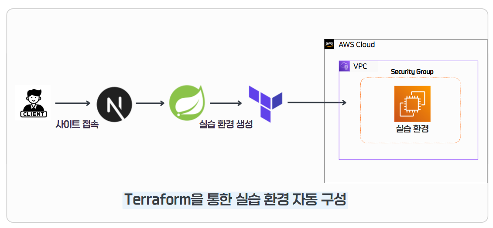
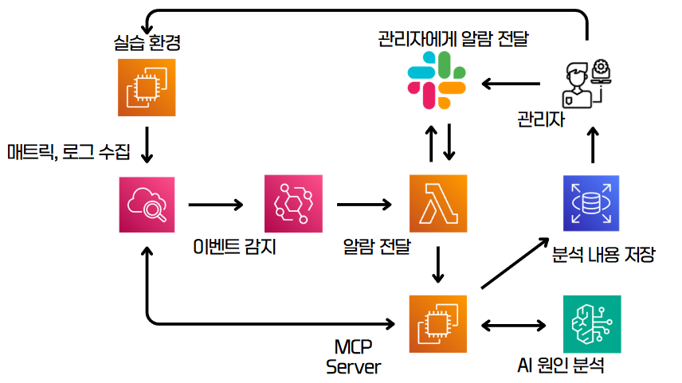

# Terraform Runner for CVE Lab Session

## 1. Terraform 개요

 **Terraform을 사용하여 CVE 실습용 AWS EC2 Lab Session을 자동으로 생성하고, 해당 인스턴스에 대한 CloudWatch 기반 관측 및 알림 구조를 함께 구성**하는 것을 목표로 한다.

사용자가 CVE 실습을 시작하면 Terraform Runner는 입력받은 `cve_id`, `uuid`, `user_id` 값을 기반으로 실습용 EC2 인스턴스를 생성한다. 생성된 인스턴스는 Private Subnet에 배치되며, Guacamole과 같은 원격 접속 시스템에서 사용할 수 있도록 Private IP, Private DNS, Protocol 정보를 Output으로 반환한다.

또한 단순히 EC2만 생성하는 것이 아니라, 실습 인스턴스별 CloudWatch Log Group, Metric Filter, Alarm을 함께 구성하여 실습 환경에서 발생하는 오류, 인증 실패, 애플리케이션 크래시, CPU/Memory/Disk 이상 상태를 감지할 수 있도록 설계하였다.

CloudWatch Alarm이 `ALARM` 상태가 되면 EventBridge Rule을 통해 기존 Slack 알림 Lambda인 `cvexpert-alarm-notifier`를 호출하여 운영자가 이상 상황을 빠르게 인지할 수 있도록 구성하였다.

---

## 2. Terraform Runner 구성 목적

본 Terraform Runner는 단순 EC2 생성 자동화가 아니라, **사용자별 CVE 실습 세션을 생성하고 관측 가능한 상태로 운영하기 위한 IaC 구성**이다.

주요 목표는 다음과 같다.

* 사용자별 CVE 실습 EC2 인스턴스 자동 생성
* `cve_id`, `uuid`, `user_id` 기반 Lab Session 식별
* Private Subnet 기반 실습 인스턴스 배치
* Guacamole 연동을 위한 접속 정보 Output 제공
* EC2에 CloudWatch Agent용 IAM Instance Profile 연결
* 실습 인스턴스별 CloudWatch Log Group 생성
* syslog, auth, docker 로그 기반 Metric Filter 구성
* CPU, Memory, Disk, Status Check 기반 CloudWatch Alarm 구성
* CloudWatch Alarm 발생 시 EventBridge를 통해 Slack 알림 Lambda 호출
* 실습 종료 시 Terraform Destroy를 통한 리소스 정리

---

## 3. 전체 아키텍처




---

## 4. Observability Architecture




---

## 5. Terraform 파일 구성

본 Terraform Runner는 다음 파일들로 구성된다.

```text
terraform-runner/
├── main.tf
├── variables.tf
├── outputs.tf
├── iam.tf
├── common-observability.tf
└── README.md
```

각 파일의 역할은 다음과 같다.

| 파일                        | 역할                                                                            |
| ------------------------- | ----------------------------------------------------------------------------- |
| `main.tf`                 | AWS Provider, EC2 Lab Instance, CloudWatch Log Group, Metric Filter, Alarm 정의 |
| `variables.tf`            | region, cve_id, uuid, user_id, subnet_id, security_group_id, ami_id 등 변수 정의   |
| `outputs.tf`              | Guacamole 및 Backend에서 사용할 Lab Session 결과값 출력                                  |
| `iam.tf`                  | EC2가 CloudWatch Agent를 사용할 수 있도록 IAM Role 및 Instance Profile 정의               |
| `common-observability.tf` | CloudWatch Alarm 상태 변화를 EventBridge로 감지하고 Slack 알림 Lambda에 연결                 |

---

## 6. Lab Session Provisioning

Terraform Runner는 CVE 실습 세션마다 EC2 인스턴스를 생성한다.

```hcl
resource "aws_instance" "lab_instance" {
  ami           = var.ami_id
  instance_type = var.instance_type

  subnet_id              = var.subnet_id
  vpc_security_group_ids = [var.security_group_id]

  key_name = var.key_name

  iam_instance_profile = var.iam_instance_profile

  tags = {
    Name        = "lab-${var.cve_id}-${var.uuid}"
    Project     = var.project
    CVE_ID      = var.cve_id
    Lab_Session = var.uuid
    TTL_Minutes = tostring(var.ttl_minutes)
  }
}
```

이 구성은 다음 정보를 기준으로 실습 인스턴스를 생성한다.

| 항목                     | 설명                                       |
| ---------------------- | ---------------------------------------- |
| `ami_id`               | CVE 실습 환경이 포함된 AMI                       |
| `instance_type`        | 실습 인스턴스 타입                               |
| `subnet_id`            | EC2가 생성될 Private Subnet                  |
| `security_group_id`    | EC2에 연결할 Security Group                  |
| `key_name`             | SSH 접속에 사용할 Key Pair                     |
| `iam_instance_profile` | CloudWatch Agent 권한을 위한 Instance Profile |

---

## 7. Tagging Strategy

생성되는 EC2 인스턴스에는 Lab Session 추적을 위한 Tag가 부여된다.

| Tag Key       | 값                               | 설명          |
| ------------- | ------------------------------- | ----------- |
| `Name`        | `lab-${var.cve_id}-${var.uuid}` | 실습 인스턴스 이름  |
| `Project`     | `${var.project}`                | 프로젝트 이름     |
| `CVE_ID`      | `${var.cve_id}`                 | 실습 대상 CVE   |
| `Lab_Session` | `${var.uuid}`                   | 실습 세션 고유 ID |
| `TTL_Minutes` | `${var.ttl_minutes}`            | 실습 만료 시간    |

예시:

```text
Name        = lab-CVE-2025-29927-1010101
Project     = cvexpert
CVE_ID      = CVE-2025-29927
Lab_Session = 1010101
TTL_Minutes = 60
```

### Tagging 목적

* 사용자별 실습 세션 식별
* CVE별 실습 인스턴스 구분
* CloudWatch Log Group 및 Alarm과 실습 세션 연결
* 비용 및 리소스 추적
* 향후 TTL 기반 자동 삭제 기능 확장

---

## 8. Variables

Terraform Runner는 `variables.tf`를 통해 실행 시 필요한 값을 주입받는다.

| Variable               | 설명                               | 기본값                            |
| ---------------------- | -------------------------------- | ------------------------------ |
| `region`               | AWS Region                       | `ap-northeast-2`               |
| `project`              | 프로젝트명                            | `cvexpert`                     |
| `cve_id`               | CVE 식별자                          | 필수 입력                          |
| `uuid`                 | 실습 세션 고유 ID                      | 필수 입력                          |
| `user_id`              | 사용자 ID                           | 필수 입력                          |
| `subnet_id`            | Private Subnet ID                | 환경별 기본값                        |
| `security_group_id`    | Security Group ID                | 환경별 기본값                        |
| `ami_id`               | 실습 EC2 생성에 사용할 AMI ID            | 환경별 기본값                        |
| `instance_type`        | EC2 Instance Type                | `t3.small`                     |
| `ttl_minutes`          | 실습 만료 시간                         | `60`                           |
| `protocol`             | Guacamole 연결 프로토콜                | `ssh`                          |
| `key_name`             | EC2 Key Pair 이름                  | `vm-provisioning-key`          |
| `iam_instance_profile` | EC2에 연결할 IAM Instance Profile    | `EC2-CloudWatch-Role`          |
| `metrics_namespace`    | CloudWatch Metric Namespace      | `cvexpert/CVE-2025-29927`      |
| `logs_namespace`       | CloudWatch Logs Metric Namespace | `cvexpert/CVE-2025-29927/Logs` |

실행 시 반드시 필요한 값은 다음과 같다.

```text
cve_id
uuid
user_id
```

---

## 9. Outputs

Terraform Apply가 완료되면 다음 Output을 반환한다.

| Output        | 설명                |
| ------------- | ----------------- |
| `cve_id`      | 실습 대상 CVE ID      |
| `user_id`     | 사용자 ID            |
| `protocol`    | Guacamole 연결 프로토콜 |
| `instance_id` | 생성된 EC2 인스턴스 ID   |
| `region`      | 인스턴스가 생성된 Region  |
| `hostname`    | EC2 Private DNS   |
| `private_ip`  | EC2 Private IP    |
| `created_at`  | 생성 시각             |
| `expires_at`  | 만료 예정 시각          |
| `status`      | Lab Session 상태    |

출력 예시:

```text
Outputs:

cve_id      = "CVE-2025-29927"
user_id     = "1"
protocol    = "ssh"
instance_id = "i-xxxxxxxxxxxxxxxxx"
region      = "ap-northeast-2"
hostname    = "ip-10-0-0-85.ap-northeast-2.compute.internal"
private_ip  = "10.0.0.85"
created_at  = "2025-11-28T01:22:27Z"
expires_at  = "2025-11-28T02:22:27Z"
status      = "active"
```

이 Output은 Backend 또는 Guacamole 연동 계층에서 실습 접속 정보를 구성하는 데 사용할 수 있다.

---

## 10. CloudWatch Log Groups

Terraform Runner는 실습 인스턴스별로 CloudWatch Log Group을 생성한다.

```text
/aws/ec2/cve-lab/<instance_id>/syslog
/aws/ec2/cve-lab/<instance_id>/auth
/aws/ec2/cve-lab/<instance_id>/docker
```

각 Log Group의 보관 기간은 7일로 설정되어 있다.

| Log Group | 목적                     |
| --------- | ---------------------- |
| `syslog`  | 시스템 로그 및 커널/서비스 오류 추적  |
| `auth`    | SSH 로그인 실패, 인증 실패 탐지   |
| `docker`  | 컨테이너 실행 및 애플리케이션 로그 추적 |

<!-- 여기에 CloudWatch Log Group 생성 화면 넣기 -->

---

## 11. CloudWatch Log Metric Filters

CloudWatch Log Metric Filter를 통해 로그 패턴을 Metric으로 변환한다.

| Metric Filter   | 대상 Log Group | 탐지 패턴                                                     | Metric             |
| --------------- | ------------ | --------------------------------------------------------- | ------------------ |
| `syslog_errors` | `syslog`     | `ERROR`, `CRITICAL`, `FATAL`, `Panic`                     | `SyslogErrorCount` |
| `auth_failures` | `auth`       | `Failed`, `failure`, `authentication`, `denied`           | `AuthFailureCount` |
| `app_crashes`   | `syslog`     | `segmentation fault`, `core dumped`, `SIGKILL`, `SIGSEGV` | `AppCrashCount`    |

예시 Metric Filter:

```hcl
resource "aws_cloudwatch_log_metric_filter" "auth_failures" {
  name           = "auth-failures-${var.cve_id}-${var.uuid}"
  log_group_name = aws_cloudwatch_log_group.auth.name

  pattern = "?Failed ?failure ?authentication ?denied"

  metric_transformation {
    name      = "AuthFailureCount"
    namespace = "cvexpert/CVE-2025-29927/Logs"
    value     = "1"
  }
}
```

<!-- 여기에 CloudWatch Metric Filter 화면 넣기 -->

---

## 12. CloudWatch Alarms

Terraform Runner는 실습 인스턴스 상태를 감지하기 위해 CloudWatch Alarm을 생성한다.

| Alarm                   | 조건                      | Threshold |
| ----------------------- | ----------------------- | --------- |
| `cvexpert-SyslogErrors` | Syslog error count      | 3 이상      |
| `cvexpert-AuthFailures` | Auth failure count      | 5 이상      |
| `cvexpert-AppCrashes`   | Application crash count | 1 이상      |
| `cvexpert-HighMem`      | Memory usage            | 70% 이상    |
| `cvexpert-HighCPU`      | CPU usage               | 80% 이상    |
| `cvexpert-HighCPUWait`  | CPU I/O wait            | 40% 이상    |
| `cvexpert-HighDisk`     | Disk usage              | 80% 이상    |
| `cvexpert-StatusCheck`  | EC2 StatusCheckFailed   | 1 이상      |

Alarm 이름은 다음 규칙을 따른다.

```text
cvexpert-<AlarmType>-<cve_id>-<uuid>
```

예시:

```text
cvexpert-HighCPU-CVE-2025-29927-1010101
```

<!-- 여기에 CloudWatch Alarm 생성 화면 넣기 -->

---

## 13. EventBridge to Lambda Notification

CloudWatch Alarm이 `ALARM` 상태가 되면 EventBridge Rule이 이를 감지한다.

```hcl
resource "aws_cloudwatch_event_rule" "cvexpert_alarm_rule" {
  name        = "cvexpert-alarm-to-lambda"
  description = "Send CloudWatch Alarm events to Slack notifier Lambda"

  event_pattern = jsonencode({
    "source": ["aws.cloudwatch"],
    "detail-type": ["CloudWatch Alarm State Change"],
    "detail": {
      "state": {
        "value": ["ALARM"]
      },
      "alarmName": [
        { "prefix": "cvexpert-" }
      ]
    }
  })
}
```

이 Rule은 `cvexpert-`로 시작하는 CloudWatch Alarm이 `ALARM` 상태가 되었을 때 기존 Lambda 함수인 `cvexpert-alarm-notifier`를 호출한다.

```hcl
data "aws_lambda_function" "cvexpert_alarm_notifier" {
  function_name = "cvexpert-alarm-notifier"
}
```

EventBridge가 Lambda를 호출할 수 있도록 Lambda Permission도 함께 구성한다.

```hcl
resource "aws_lambda_permission" "allow_eventbridge_to_invoke_alarm_notifier" {
  statement_id  = "AllowExecutionFromEventBridgeAlarmNotifier"
  action        = "lambda:InvokeFunction"
  function_name = data.aws_lambda_function.cvexpert_alarm_notifier.function_name
  principal     = "events.amazonaws.com"
  source_arn    = aws_cloudwatch_event_rule.cvexpert_alarm_rule.arn
}
```

<!-- 여기에 EventBridge Rule 또는 Lambda Trigger 화면 넣기 -->

---

## 14. IAM Role & Instance Profile

EC2 인스턴스가 CloudWatch Agent를 통해 Metric과 Log를 전송하려면 IAM 권한이 필요하다.

`iam.tf`에서는 EC2용 IAM Role과 Instance Profile을 생성한다.

```hcl
resource "aws_iam_role" "lab_instance_role" {
  name = "lab-ec2-cloudwatch-role"

  assume_role_policy = jsonencode({
    Version = "2012-10-17",
    Statement = [
      {
        Effect = "Allow",
        Principal = { Service = "ec2.amazonaws.com" },
        Action = "sts:AssumeRole"
      }
    ]
  })
}
```

CloudWatch Agent 권한은 AWS Managed Policy를 Attach하여 부여한다.

```hcl
resource "aws_iam_role_policy_attachment" "lab_cloudwatch_policy" {
  role       = aws_iam_role.lab_instance_role.name
  policy_arn = "arn:aws:iam::aws:policy/CloudWatchAgentServerPolicy"
}
```

Instance Profile:

```hcl
resource "aws_iam_instance_profile" "lab_instance_profile" {
  name = "lab-ec2-instance-profile"
  role = aws_iam_role.lab_instance_role.name
}
```

주의할 점은 `main.tf`의 EC2 인스턴스는 현재 다음 변수 값을 사용한다.

```hcl
iam_instance_profile = var.iam_instance_profile
```

따라서 `iam.tf`에서 생성한 `aws_iam_instance_profile.lab_instance_profile.name`을 직접 참조하지 않는다.
실제로 Terraform에서 생성한 Instance Profile을 EC2에 연결하려면 다음과 같이 변경할 수 있다.

```hcl
iam_instance_profile = aws_iam_instance_profile.lab_instance_profile.name
```

또는 변수 `iam_instance_profile`의 값을 `"lab-ec2-instance-profile"`로 맞춰야 한다.

---

## 15. 실행 방법

Terraform Runner 실행 전 AWS Credential이 설정되어 있어야 한다.

### 15.1 AWS Credential 설정

```bash
aws configure
```

또는 환경 변수를 사용할 수 있다.

```bash
export AWS_ACCESS_KEY_ID="<ACCESS_KEY>"
export AWS_SECRET_ACCESS_KEY="<SECRET_KEY>"
export AWS_DEFAULT_REGION="ap-northeast-2"
```

Credential 정보는 Git Repository에 절대 포함하지 않는다.

---

### 15.2 Terraform 초기화

```bash
terraform init
```

---

### 15.3 Terraform 실행 계획 확인

```bash
terraform plan \
  -var="cve_id=CVE-2025-29927" \
  -var="uuid=1010101" \
  -var="user_id=1"
```

필요한 경우 AMI, Subnet, Security Group, Instance Type도 함께 지정할 수 있다.

```bash
terraform plan \
  -var="cve_id=CVE-2025-29927" \
  -var="uuid=1010101" \
  -var="user_id=1" \
  -var="ami_id=ami-xxxxxxxxxxxxxxxxx" \
  -var="subnet_id=subnet-xxxxxxxxxxxxxxxxx" \
  -var="security_group_id=sg-xxxxxxxxxxxxxxxxx" \
  -var="instance_type=t3.small"
```

---

### 15.4 Lab Session 생성

```bash
terraform apply \
  -var="cve_id=CVE-2025-29927" \
  -var="uuid=1010101" \
  -var="user_id=1"
```

자동 승인을 사용하려면 다음과 같이 실행한다.

```bash
terraform apply -auto-approve \
  -var="cve_id=CVE-2025-29927" \
  -var="uuid=1010101" \
  -var="user_id=1"
```

---

## 16. 검증 방법

Terraform 실행 후 다음 항목을 확인한다.

### 16.1 Terraform State 확인

```bash
terraform state list
```

예상 리소스:

```text
aws_instance.lab_instance
aws_cloudwatch_log_group.syslog
aws_cloudwatch_log_group.auth
aws_cloudwatch_log_group.docker
aws_cloudwatch_log_metric_filter.syslog_errors
aws_cloudwatch_log_metric_filter.auth_failures
aws_cloudwatch_log_metric_filter.app_crashes
aws_cloudwatch_metric_alarm.high_memory
aws_cloudwatch_metric_alarm.high_cpu_usage
aws_cloudwatch_metric_alarm.high_cpu_iowait
aws_cloudwatch_metric_alarm.high_disk_usage
aws_cloudwatch_metric_alarm.status_check_failed
aws_cloudwatch_event_rule.cvexpert_alarm_rule
aws_cloudwatch_event_target.cvexpert_alarm_notifier_target
aws_lambda_permission.allow_eventbridge_to_invoke_alarm_notifier
```

---

### 16.2 Terraform Output 확인

```bash
terraform output
```

예상 결과:

```text
cve_id      = "CVE-2025-29927"
user_id     = "1"
protocol    = "ssh"
instance_id = "i-xxxxxxxxxxxxxxxxx"
region      = "ap-northeast-2"
hostname    = "ip-10-0-0-85.ap-northeast-2.compute.internal"
private_ip  = "10.0.0.85"
created_at  = "2025-11-28T01:22:27Z"
expires_at  = "2025-11-28T02:22:27Z"
status      = "active"
```

<!-- 여기에 terraform output 결과 화면 넣기 -->

---

### 16.3 AWS EC2 Console 확인

AWS Console에서 다음 항목을 확인한다.

* EC2 인스턴스 생성 여부
* Private IP
* Private DNS
* Instance Type
* Subnet
* Security Group
* IAM Role
* Tag 값

<!-- 여기에 AWS EC2 Console 화면 넣기 -->

---

### 16.4 CloudWatch Log Group 확인

CloudWatch Logs에서 다음 Log Group이 생성되었는지 확인한다.

```text
/aws/ec2/cve-lab/<instance_id>/syslog
/aws/ec2/cve-lab/<instance_id>/auth
/aws/ec2/cve-lab/<instance_id>/docker
```

<!-- 여기에 CloudWatch Log Group 화면 넣기 -->

---

### 16.5 CloudWatch Alarm 확인

CloudWatch Alarm에서 `cvexpert-` prefix를 가진 Alarm들이 생성되었는지 확인한다.

```text
cvexpert-SyslogErrors-<cve_id>-<uuid>
cvexpert-AuthFailures-<cve_id>-<uuid>
cvexpert-AppCrashes-<cve_id>-<uuid>
cvexpert-HighMem-<cve_id>-<uuid>
cvexpert-HighCPU-<cve_id>-<uuid>
cvexpert-HighCPUWait-<cve_id>-<uuid>
cvexpert-HighDisk-<cve_id>-<uuid>
cvexpert-StatusCheck-<cve_id>-<uuid>
```

<!-- 여기에 CloudWatch Alarm 화면 넣기 -->

---

### 16.6 EventBridge Rule 확인

EventBridge에서 다음 Rule이 생성되었는지 확인한다.

```text
cvexpert-alarm-to-lambda
```

이 Rule의 Target이 다음 Lambda 함수로 설정되어 있는지 확인한다.

```text
cvexpert-alarm-notifier
```

<!-- 여기에 EventBridge Rule Target 화면 넣기 -->

---

## 17. Lab Session 삭제

실습이 끝난 뒤에는 비용 발생을 방지하기 위해 Terraform Destroy를 실행한다.

```bash
terraform destroy \
  -var="cve_id=CVE-2025-29927" \
  -var="uuid=1010101" \
  -var="user_id=1"
```

자동 승인을 사용하려면 다음과 같이 실행한다.

```bash
terraform destroy -auto-approve \
  -var="cve_id=CVE-2025-29927" \
  -var="uuid=1010101" \
  -var="user_id=1"
```

삭제 확인:

```bash
terraform state list
```

리소스가 모두 삭제되면 state에 관리 중인 리소스가 없어야 한다.

---

## 18. 보안 주의사항

Terraform Runner는 AWS 인프라 리소스를 생성하므로 민감 정보 관리가 중요하다.

### 18.1 Git에 포함하면 안 되는 파일

다음 파일은 GitHub 또는 공개 Repository에 절대 Commit하지 않는다.

```text
*.tfstate
*.tfstate.backup
terraform.tfstate
terraform.tfstate.backup
.terraform/
.terraform.lock.hcl
*.tfvars
*.pem
*.key
id_rsa
id_rsa.pub
```

특히 `terraform.tfstate`와 `terraform.tfstate.backup`에는 실제 AWS Account ID, ARN, Lambda 환경 변수, 리소스 ID, IP 주소 등이 포함될 수 있다.
따라서 공개 저장소에 업로드하면 안 된다.

### 18.2 State File 관리

현재 Terraform 상태 파일은 로컬 `terraform.tfstate`로 관리될 수 있다.
협업 또는 운영 환경에서는 S3 Backend와 DynamoDB Lock을 사용하는 것이 더 안전하다.

권장 Backend 예시:

```hcl
terraform {
  backend "s3" {
    bucket         = "<TFSTATE_BUCKET>"
    key            = "terraform-runner/cve-lab/terraform.tfstate"
    region         = "ap-northeast-2"
    dynamodb_table = "<TFSTATE_LOCK_TABLE>"
    encrypt        = true
  }
}
```

---

## 19. Troubleshooting

Terraform Runner 구성 과정에서 발생할 수 있는 주요 문제와 해결 방법을 정리하였다.

---

### 19.1 IAM Instance Profile이 EC2에 연결되지 않는 문제

#### 문제 상황

EC2 인스턴스는 생성되었지만 CloudWatch Agent가 로그 또는 메트릭을 전송하지 못한다.

#### 원인

EC2에 CloudWatch 권한이 있는 IAM Instance Profile이 연결되지 않았을 수 있다.
현재 `iam.tf`에서 Instance Profile을 생성하지만, `main.tf`는 `var.iam_instance_profile` 값을 사용한다.

#### 확인 방법

EC2 Console에서 인스턴스의 IAM Role을 확인한다.

```bash
aws ec2 describe-instances \
  --instance-ids <INSTANCE_ID> \
  --query "Reservations[*].Instances[*].IamInstanceProfile"
```

#### 해결 방법

Terraform에서 생성한 Instance Profile을 직접 참조하도록 수정한다.

```hcl
iam_instance_profile = aws_iam_instance_profile.lab_instance_profile.name
```

또는 변수 값을 생성된 Instance Profile 이름과 맞춘다.

```bash
-var="iam_instance_profile=lab-ec2-instance-profile"
```

---

### 19.2 CloudWatch Alarm은 생성되었지만 데이터가 부족한 문제

#### 문제 상황

CloudWatch Alarm이 `INSUFFICIENT_DATA` 상태로 표시된다.

#### 원인

EC2 인스턴스에서 CloudWatch Agent가 해당 Metric을 전송하지 않았거나, Metric Namespace가 Terraform에서 지정한 값과 다를 수 있다.

Terraform Alarm은 다음 Namespace를 기준으로 Metric을 찾는다.

```text
cvexpert/CVE-2025-29927
```

#### 해결 방법

EC2 내부에서 CloudWatch Agent 상태를 확인한다.

```bash
sudo systemctl status amazon-cloudwatch-agent
```

CloudWatch Console에서 실제 전송되는 Metric Namespace와 Metric Name을 확인한다.

확인할 Metric:

```text
CPU_USAGE
CPU_IOWAIT
MEMORY_USED
DISK_USED
```

---

### 19.3 Log Metric Filter는 있지만 로그가 수집되지 않는 문제

#### 문제 상황

CloudWatch Log Group은 생성되었지만 로그 이벤트가 들어오지 않는다.

#### 원인

Terraform은 Log Group을 생성하지만, EC2 내부에서 CloudWatch Agent가 해당 Log Group으로 로그를 보내도록 설정되어 있어야 한다.

#### 해결 방법

EC2 내부의 CloudWatch Agent 설정에서 다음 Log Group을 바라보는지 확인한다.

```text
/aws/ec2/cve-lab/<instance_id>/syslog
/aws/ec2/cve-lab/<instance_id>/auth
/aws/ec2/cve-lab/<instance_id>/docker
```

CloudWatch Agent 재시작:

```bash
sudo systemctl restart amazon-cloudwatch-agent
```

---

### 19.4 EventBridge는 생성되었지만 Lambda 알림이 오지 않는 문제

#### 문제 상황

CloudWatch Alarm이 `ALARM` 상태가 되었지만 Slack 알림이 오지 않는다.

#### 원인

EventBridge Rule Target이 Lambda에 연결되지 않았거나, Lambda Permission이 제대로 부여되지 않았을 수 있다.
또한 기존 Lambda 함수 `cvexpert-alarm-notifier`가 존재하지 않으면 Terraform Apply가 실패한다.

#### 확인 방법

Lambda 함수 존재 여부 확인:

```bash
aws lambda get-function \
  --function-name cvexpert-alarm-notifier
```

EventBridge Target 확인:

```bash
aws events list-targets-by-rule \
  --rule cvexpert-alarm-to-lambda
```

#### 해결 방법

* `cvexpert-alarm-notifier` Lambda 함수가 먼저 생성되어 있어야 한다.
* EventBridge Rule Target이 Lambda ARN을 가리키는지 확인한다.
* Lambda Permission에 EventBridge Source ARN이 등록되어 있는지 확인한다.

---

### 19.5 Private IP만 출력되어 외부에서 SSH 접속이 안 되는 문제

#### 문제 상황

Terraform Output에 `private_ip`만 표시되고 Public IP가 없어 외부 PC에서 직접 SSH 접속이 불가능하다.

#### 원인

실습 인스턴스는 Private Subnet에 생성되도록 설계되어 있다.
따라서 외부에서 직접 SSH 접속하는 구조가 아니라, Guacamole 또는 Bastion Host를 통해 접근해야 한다.

#### 해결 방법

다음 구조 중 하나를 사용한다.

```text
사용자 → Guacamole → Private EC2
사용자 → Bastion Host → Private EC2
VPN 사용자 → Private EC2
```

이 프로젝트에서는 Guacamole 연동을 전제로 `private_ip`, `hostname`, `protocol`을 Output으로 제공한다.

---

### 19.6 Terraform Destroy 후 일부 공통 리소스까지 삭제되는 문제

#### 문제 상황

Lab Session 삭제 시 EventBridge Rule, Lambda Permission과 같은 공통 Observability 리소스도 함께 삭제될 수 있다.

#### 원인

`common-observability.tf`의 EventBridge Rule과 Lambda Permission은 세션별 리소스라기보다는 공통 리소스에 가깝다.
하지만 Lab Session Terraform과 같은 State에서 관리하면 `terraform destroy` 시 함께 삭제된다.

#### 해결 방법

공통 Observability 리소스는 별도 Terraform State로 분리하는 것이 좋다.

```text
terraform/
├── common-observability/
│   ├── common-observability.tf
│   └── terraform.tfstate
└── runner/
    ├── main.tf
    ├── variables.tf
    ├── outputs.tf
    └── terraform.tfstate
```

---


